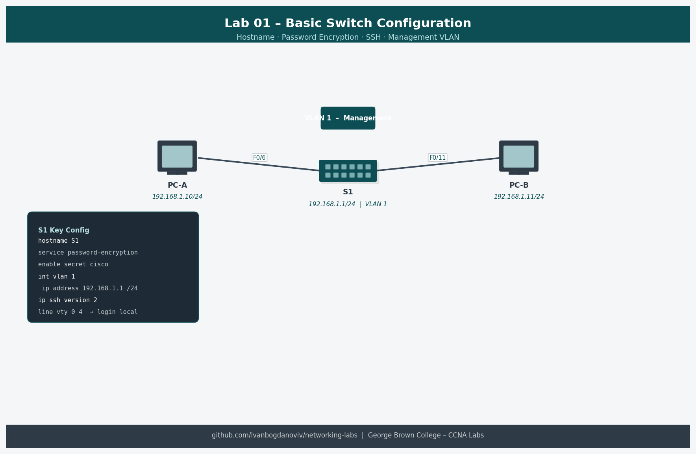
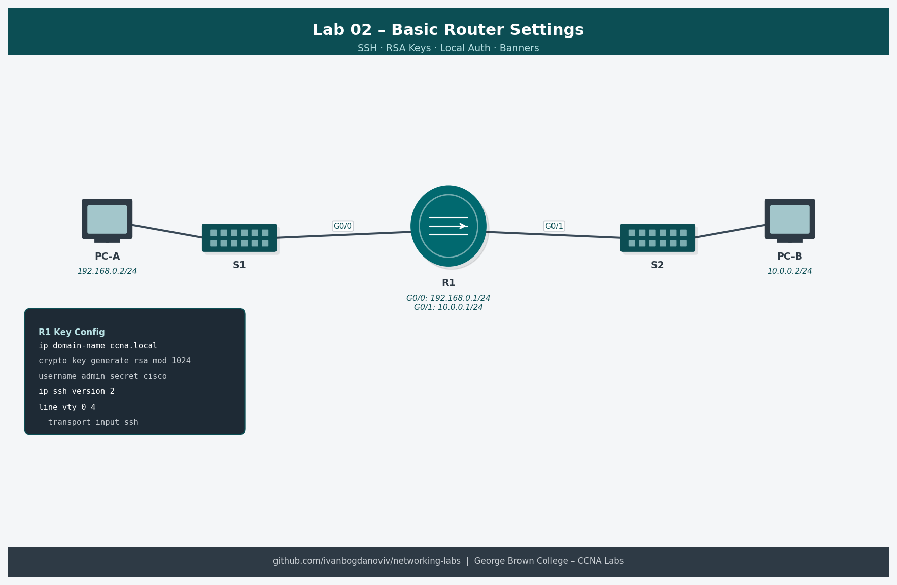
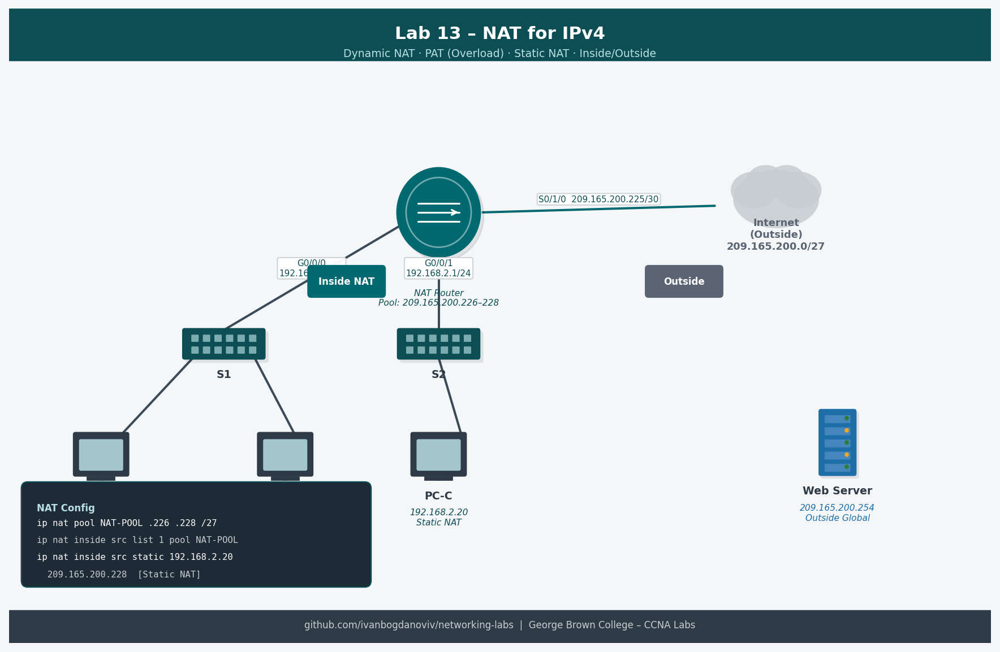

# Networking Labs — Ivan Bogdanov Ivanov

CCNA-level networking labs completed at George Brown College (2025–2026).
All labs run on NDG NETLAB+ with Cisco IOS virtual equipment.


## Labs Completed

| # | Lab | Topic | Date |
|---|-----|-------|------|
| 01 | 1.1.7 Basic Switch Configuration | Switch hardening, passwords, SSH | Oct 2025 |
| 02 | 1.6.2 Basic Router Settings | Router interfaces, connectivity | Oct 2025 |
| 03 | 3.4.6 Configure VLANs and Trunking | VLAN segmentation, trunk links | Oct 2025 |
| 04 | 3.6.2 Implement VLANs and Trunking | Advanced trunking, STP portfast | Oct 2025 |
| 05 | 4.2.8 Router-on-a-Stick Inter-VLAN | ROAS, 802.1Q sub-interfaces | Oct 2025 |
| 06 | 4.2.8 Router-on-a-Stick v2 | ROAS reinforcement | Dec 2025 |
| 07 | 6.4.2 Implement EtherChannel | LACP link aggregation | Oct 2025 |
| 08 | 7.4.2 Implement DHCPv4 | DHCP server, relay agent | Oct–Nov 2025 |
| 09 | 15.6.2 IPv4 and IPv6 Static Routes | Static/default routing, dual-stack | Nov 2025 |
| 10 | 16.3.2 Troubleshoot Static Routes | Methodical troubleshooting | Nov 2025 |
| 11 | 2.7.2 Single-Area OSPFv2 | OSPF, router-ID, adjacency | Jan 2026 |
| 12 | 5.5.2 Extended IPv4 ACLs | ACL design, permit/deny, SSH block | Feb 2026 |
| 13 | 6.8.2 Configure NAT for IPv4 | Dynamic NAT, PAT, static NAT | Feb 2026 |
| — | Open Lab ASA Pod | Cisco ASA firewall basics | Oct 2025 |

## Network Topology Diagrams

Each lab includes a network topology diagram showing device connections, IP addressing, and configuration highlights.

| Lab | Topology |
|-----|---------|
| Basic Switch Config |  |
| Basic Router Settings |  |
| VLANs & Trunking |  |
| EtherChannel |  |
| OSPF Single Area |  |
| NAT IPv4 |  |

## Device Configs

Real Cisco IOS running-config exports from lab sessions. Each file includes inline verification output (show command results) at the bottom.

| File | Lab | Description |
|---|---|---|
| `configs/03-vlans-trunking-sw1.txt` | Lab 03 | SW1 with VLANs 10/20/30, trunk to SW2, access ports, management SVI |
| `configs/05-inter-vlan-routing-router.txt` | Lab 05 | R1 Router-on-a-Stick with subinterfaces, DHCP pools, default route |
| `configs/11-ospfv2-r1.txt` | Lab 11 | R1 OSPFv2 single-area, router-ID 1.1.1.1, passive interfaces, loopback |
| `configs/12-extended-acls-router.txt` | Lab 12 | R1 with BLOCK-TELNET and IT-TO-FINANCE named extended ACLs |
| `configs/13-nat-ipv4-router.txt` | Lab 13 | R1 with dynamic NAT pool, PAT overload, static NAT for web server |

## Documentation

| File | Description |
|---|---|
| `docs/ios-command-reference.md` | Quick reference for 30 most-used IOS commands organized by category (Basic, VLAN, Trunk, Routing, OSPF, ACL, NAT, DHCP, Troubleshooting) |

## Utility Scripts

| Script | Description |
|--------|-------------|
| `scripts/subnet_calculator.py` | CIDR or IP+mask input. Shows network, broadcast, first/last host, wildcard mask. `--split N` divides into N equal subnets. Colorized output. |
| `scripts/ping_sweep.sh` | Discovers live hosts on a /24 subnet |
| `scripts/vlan_checker.py` | Parses `show vlan brief` + `show interfaces trunk` output. Accepts a single file or a directory. Flags trunk/active mismatches and portless VLANs. `-o` exports to CSV. |

## Topics Covered
- Switch and router initial configuration
- VLANs, trunking (802.1Q), native VLANs
- Router-on-a-Stick inter-VLAN routing
- EtherChannel (LACP)
- DHCPv4 (server + relay)
- IPv4 and IPv6 static/default routes
- OSPF single-area routing
- Extended ACLs
- NAT/PAT (dynamic, static, overload)
- Cisco ASA firewall basics

## How to Use the Scripts
```bash
# Subnet calculator — CIDR input
python3 scripts/subnet_calculator.py 10.53.0.0/30

# Subnet calculator — IP + mask input
python3 scripts/subnet_calculator.py 192.168.1.0 255.255.255.0

# Split a network into 4 equal subnets
python3 scripts/subnet_calculator.py 172.16.0.0/16 --split 4

# Ping sweep your lab /24
chmod +x scripts/ping_sweep.sh
./scripts/ping_sweep.sh 192.168.1

# Check a single show vlan brief output file
python3 scripts/vlan_checker.py my_vlan_output.txt

# Check all .txt files in a directory
python3 scripts/vlan_checker.py ./switch-outputs/

# Check and export results to CSV
python3 scripts/vlan_checker.py ./switch-outputs/ -o vlan_report.csv
```

## Adding Your Own Configs
Drop Cisco IOS config exports (.txt) into `configs/` and they will be version-controlled here.

## About
Built by Ivan Bogdanov Ivanov — Computer Systems Technician student at George Brown College, Toronto.
Target roles: Junior IT Support | Network Technician | Help Desk
Portfolio: [www.ivanbiv.com](https://www.ivanbiv.com)
