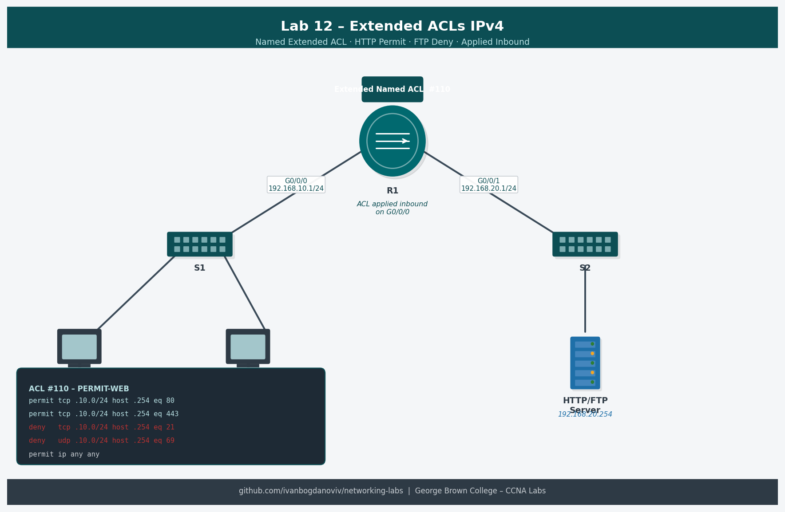

# Lab 03 – ACL Basics (Standard ACL)



## Objective
Configure standard and extended ACLs to control network traffic. Apply ACLs to router interfaces and verify filtering behavior.

## Topology
- R1 with two LAN interfaces
- PC-A: 192.168.10.10 (permitted)
- PC-B: 192.168.10.11 (restricted)
- Server: 192.168.20.254

## Standard ACL Example
```
ip access-list standard BLOCK-PC-B
 deny host 192.168.10.11
 permit any
interface g0/0/1
 ip access-group BLOCK-PC-B out
```

## Extended ACL Example
```
ip access-list extended PERMIT-WEB
 permit tcp 192.168.10.0 0.0.0.255 host 192.168.20.254 eq 80
 deny ip any any
interface g0/0/0
 ip access-group PERMIT-WEB in
```

## Verification
- `show access-lists` — view ACL rules and hit counts
- `show ip interface g0/0/0` — confirm ACL applied to interface
- Test with ping and telnet from different hosts

## Learning Outcomes
- Difference between standard and extended ACLs
- Named vs numbered ACLs
- Inbound vs outbound ACL placement
- Wildcard mask calculation
