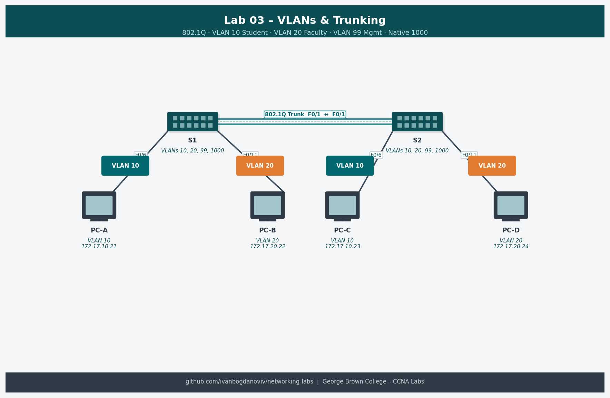

# Lab 03 — Configure VLANs and Trunking (3.4.6)

**Course:** CCNA Enterprise Networking, Security and Automation (CCNAv7)
**Platform:** NDG NETLAB+ / Cisco Packet Tracer
**Completed:** 2025-10-30
**Difficulty:** ⭐⭐⭐

## Objective
Create and name VLANs on Cisco switches, assign access ports to VLANs, and configure trunk links between switches. Understand the purpose of native VLANs and verify VLAN propagation.

## Topology


```
       PC-A (VLAN 20)    PC-B (VLAN 30)
           |                   |
         F0/6               F0/18
           |                   |
         [S1]====F0/1 trunk=====[S2]
                                 |
                              PC-C (VLAN 10)
                              PC-D (VLAN 30)
```

## Addressing Table
| Device | Interface | IP Address | Subnet Mask | Default Gateway |
|--------|-----------|------------|-------------|-----------------|
| S1 | VLAN 99 | 192.168.99.11 | 255.255.255.0 | 192.168.99.1 |
| S2 | VLAN 99 | 192.168.99.12 | 255.255.255.0 | 192.168.99.1 |
| PC-A | NIC | 192.168.20.3 | 255.255.255.0 | 192.168.20.1 |
| PC-B | NIC | 192.168.30.3 | 255.255.255.0 | 192.168.30.1 |
| PC-C | NIC | 192.168.10.3 | 255.255.255.0 | 192.168.10.1 |
| PC-D | NIC | 192.168.30.4 | 255.255.255.0 | 192.168.30.1 |

## Key Configurations
### S1 — VLANs and Trunk
```
S1(config)# vlan 10
S1(config-vlan)# name Management
S1(config)# vlan 20
S1(config-vlan)# name Sales
S1(config)# vlan 30
S1(config-vlan)# name Operations
S1(config)# vlan 99
S1(config-vlan)# name Native

! Management interface
S1(config)# interface vlan 99
S1(config-if)# ip address 192.168.99.11 255.255.255.0
S1(config-if)# no shutdown

! Access port
S1(config)# interface f0/6
S1(config-if)# switchport mode access
S1(config-if)# switchport access vlan 20

! Trunk port
S1(config)# interface f0/1
S1(config-if)# switchport mode trunk
S1(config-if)# switchport trunk native vlan 99
S1(config-if)# switchport trunk allowed vlan 10,20,30,99
```

## Verification Commands
```
show vlan brief
show interfaces trunk
show interfaces f0/1 switchport
show running-config
```

## What I Learned
- VLANs segment broadcast domains — devices in different VLANs cannot communicate without a router
- Trunk links carry multiple VLANs using 802.1Q tagging
- Native VLAN frames cross the trunk untagged — both sides must match or traffic gets misrouted
- `show vlan brief` shows VLAN assignments; `show interfaces trunk` shows trunk status
- Management VLAN (99) should be different from default VLAN 1 for security

## Troubleshooting Notes
- VLAN missing from `show vlan brief`: VLAN not created on that switch
- Port not in correct VLAN: verify `switchport access vlan X` is applied
- Trunk not forming: check both sides have `switchport mode trunk` or compatible modes
- Native VLAN mismatch causes CDP warnings and can misroute untagged traffic
