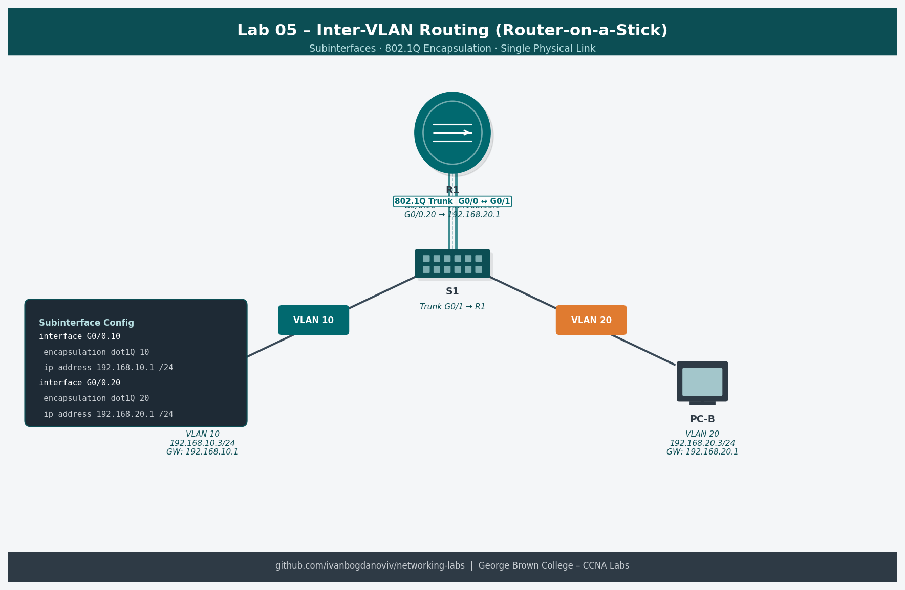

# Lab 05 — Configure Router-on-a-Stick Inter-VLAN Routing (4.2.8)

**Course:** CCNA Enterprise Networking, Security and Automation (CCNAv7)
**Platform:** NDG NETLAB+ / Cisco Packet Tracer
**Completed:** 2025-10-01
**Difficulty:** ⭐⭐⭐

## Objective
Configure Router-on-a-Stick (ROAS) to enable inter-VLAN routing using a single physical router interface divided into 802.1Q sub-interfaces. Verify that hosts in different VLANs can communicate through R1.

## Topology


```
PC-A (VLAN 20)   PC-B (VLAN 30)
      |                 |
    F0/6             F0/18
      |                 |
    [S1]====G0/1 trunk====[R1]
                          |
                       G0/0/1.20  (10.20.0.1)
                       G0/0/1.30  (10.30.0.1)
                       G0/0/1.40  (10.40.0.1)
                       G0/0/1.1000 (native)
```

## Addressing Table
| Device | Interface | IP Address | Subnet Mask | Default Gateway |
|--------|-----------|------------|-------------|-----------------|
| R1 | G0/0/1.20 | 10.20.0.1 | 255.255.255.0 | — |
| R1 | G0/0/1.30 | 10.30.0.1 | 255.255.255.0 | — |
| R1 | G0/0/1.40 | 10.40.0.1 | 255.255.255.0 | — |
| S1 | VLAN 1000 | 10.100.0.2 | 255.255.255.0 | 10.100.0.1 |
| PC-A | NIC | 10.20.0.10 | 255.255.255.0 | 10.20.0.1 |
| PC-B | NIC | 10.30.0.10 | 255.255.255.0 | 10.30.0.1 |

## Key Configurations
### R1 — Sub-interfaces
```
R1(config)# interface g0/0/1
R1(config-if)# no shutdown

R1(config)# interface g0/0/1.20
R1(config-subif)# encapsulation dot1q 20
R1(config-subif)# ip address 10.20.0.1 255.255.255.0
R1(config-subif)# description VLAN-20-Sales

R1(config)# interface g0/0/1.30
R1(config-subif)# encapsulation dot1q 30
R1(config-subif)# ip address 10.30.0.1 255.255.255.0
R1(config-subif)# description VLAN-30-Operations

R1(config)# interface g0/0/1.40
R1(config-subif)# encapsulation dot1q 40
R1(config-subif)# ip address 10.40.0.1 255.255.255.0
R1(config-subif)# description VLAN-40-Management

R1(config)# interface g0/0/1.1000
R1(config-subif)# encapsulation dot1q 1000 native
R1(config-subif)# description Native-VLAN
```

### S1 — Trunk to Router
```
S1(config)# interface g0/1
S1(config-if)# switchport mode trunk
S1(config-if)# switchport trunk native vlan 1000
S1(config-if)# switchport trunk allowed vlan 20,30,40,1000
```

## Verification Commands
```
show ip interface brief
show interfaces g0/0/1.20
show interfaces trunk
ping 10.30.0.10 source 10.20.0.10
show ip route
```

## What I Learned
- ROAS uses one physical link and creates logical sub-interfaces per VLAN
- `encapsulation dot1q <vlan-id>` tells the sub-interface which VLAN tag to look for
- The physical interface must be `no shutdown` — sub-interfaces inherit its state
- Native VLAN on sub-interface uses `encapsulation dot1q <id> native` — no IP needed
- ROAS is cost-effective for small networks; Layer 3 switches scale better for large deployments

## Troubleshooting Notes
- Sub-interface up but no ping: verify VLAN exists on switch and trunk is carrying that VLAN
- "Encapsulation mismatch": VLAN ID on sub-interface doesn't match switch trunk VLAN
- Native VLAN mismatch: R1 native and S1 native must match to avoid untagged frame issues
