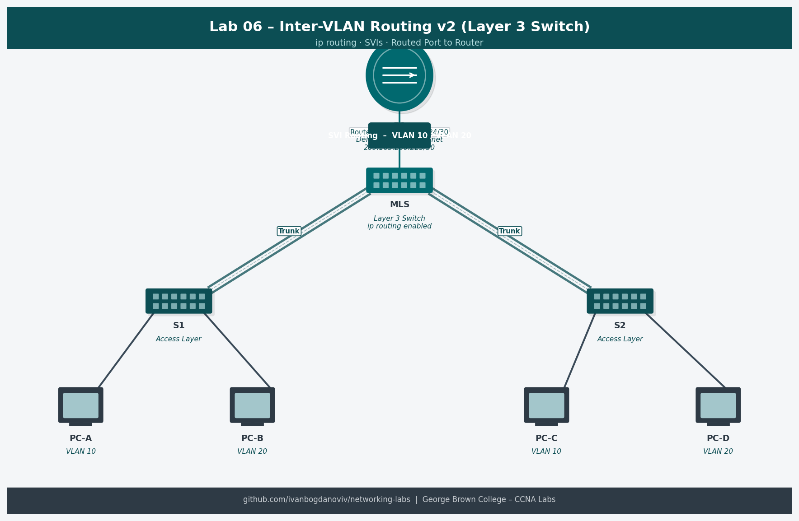

# Lab 06 — Router-on-a-Stick Inter-VLAN Routing v2 (4.2.8)

**Course:** CCNA Enterprise Networking, Security and Automation (CCNAv7)
**Platform:** NDG NETLAB+ / Cisco Packet Tracer
**Completed:** 2025-12-16
**Difficulty:** ⭐⭐⭐

## Objective
Revisit and reinforce Router-on-a-Stick inter-VLAN routing. Rebuild the lab independently from memory, identifying and resolving sub-interface configuration issues without step-by-step guidance.

## Topology


```
PC-A (VLAN 20)   PC-B (VLAN 30)
      |                 |
    F0/6             F0/18
      |                 |
    [S1]====G0/1 trunk====[R1]
                          |
                       G0/0/1.20  (10.20.0.1)
                       G0/0/1.30  (10.30.0.1)
                       G0/0/1.40  (10.40.0.1)
                       G0/0/1.1000 (native)
```

## Addressing Table
| Device | Interface | IP Address | Subnet Mask | Default Gateway |
|--------|-----------|------------|-------------|-----------------|
| R1 | G0/0/1.20 | 10.20.0.1 | 255.255.255.0 | — |
| R1 | G0/0/1.30 | 10.30.0.1 | 255.255.255.0 | — |
| R1 | G0/0/1.40 | 10.40.0.1 | 255.255.255.0 | — |
| S1 | VLAN 1000 | 10.100.0.2 | 255.255.255.0 | 10.100.0.1 |
| PC-A | NIC | 10.20.0.10 | 255.255.255.0 | 10.20.0.1 |
| PC-B | NIC | 10.30.0.10 | 255.255.255.0 | 10.30.0.1 |

## Key Configurations
### R1 — Full Sub-interface Config (from memory)
```
R1(config)# interface g0/0/1
R1(config-if)# no shutdown

R1(config)# interface g0/0/1.20
R1(config-subif)# encapsulation dot1q 20
R1(config-subif)# ip address 10.20.0.1 255.255.255.0

R1(config)# interface g0/0/1.30
R1(config-subif)# encapsulation dot1q 30
R1(config-subif)# ip address 10.30.0.1 255.255.255.0

R1(config)# interface g0/0/1.40
R1(config-subif)# encapsulation dot1q 40
R1(config-subif)# ip address 10.40.0.1 255.255.255.0

R1(config)# interface g0/0/1.1000
R1(config-subif)# encapsulation dot1q 1000 native
```

### Issues Encountered and Fixed
```
! Issue 1: Sub-interfaces showing down/down
! Root cause: Physical interface g0/0/1 was still shutdown
! Fix: interface g0/0/1 -> no shutdown

! Issue 2: Ping failing between VLANs
! Root cause: Switch trunk not allowing VLAN 40
! Fix: S1(config-if)# switchport trunk allowed vlan add 40
```

## Verification Commands
```
show ip interface brief
show interfaces trunk
show vlan brief
ping 10.30.0.10
show running-config | section interface
```

## What I Learned
- Building the same lab twice dramatically improves retention of IOS command syntax
- Always verify the physical interface is up before troubleshooting sub-interfaces
- `show interfaces trunk` is the fastest way to confirm VLAN is allowed and active on the trunk
- Using `add` keyword with `switchport trunk allowed vlan add <id>` avoids accidentally removing other VLANs
- ROAS is the stepping stone to understanding Layer 3 switch SVI routing

## Troubleshooting Notes
- Don't forget `no shutdown` on the parent physical interface
- Use `show interfaces trunk` — check "VLANs allowed and active in management domain" column
- If inter-VLAN ping fails: verify PC default gateway matches the sub-interface IP for that VLAN
