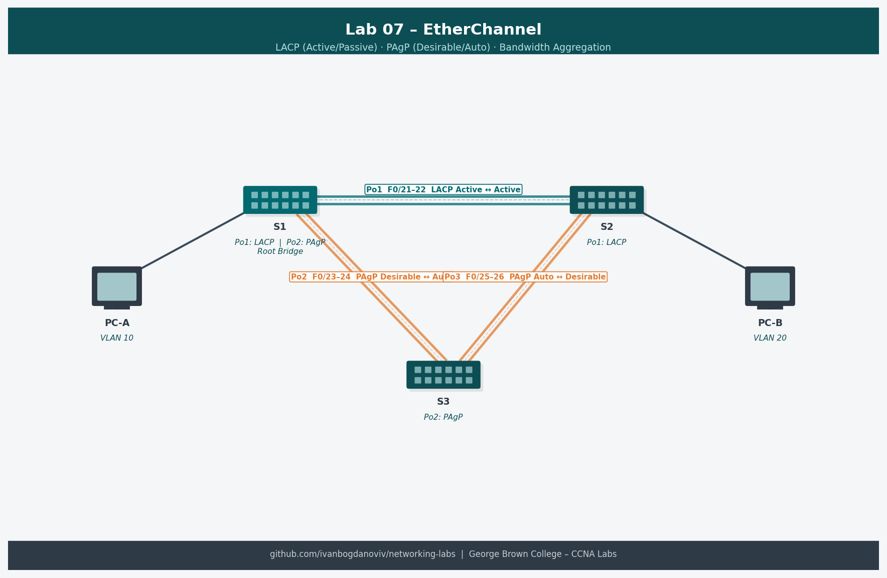

# Lab 07 — Implement EtherChannel (6.4.2)

**Course:** CCNA Enterprise Networking, Security and Automation (CCNAv7)
**Platform:** NDG NETLAB+ / Cisco Packet Tracer
**Completed:** 2025-10-30
**Difficulty:** ⭐⭐⭐

## Objective
Bundle multiple parallel physical links between two switches into a single logical EtherChannel using LACP. Configure the port-channel as a trunk and verify that bandwidth aggregation and link redundancy are functioning.

## Topology


```
     [S1]
   F0/1 | F0/2 | F0/3
   ======================== (EtherChannel - Po1)
   F0/1 | F0/2 | F0/3
     [S2]
```

## Addressing Table
| Device | Interface | IP Address | Subnet Mask | Default Gateway |
|--------|-----------|------------|-------------|-----------------|
| S1 | VLAN 99 | 192.168.99.11 | 255.255.255.0 | 192.168.99.1 |
| S2 | VLAN 99 | 192.168.99.12 | 255.255.255.0 | 192.168.99.1 |

## Key Configurations
### S1 — LACP EtherChannel
```
S1(config)# interface range f0/1-3
S1(config-if-range)# shutdown
S1(config-if-range)# channel-group 1 mode active
S1(config-if-range)# no shutdown

! Configure the port-channel interface
S1(config)# interface port-channel 1
S1(config-if)# switchport mode trunk
S1(config-if)# switchport trunk native vlan 99
S1(config-if)# switchport trunk allowed vlan 1,99
```

### S2 — LACP Passive (counterpart)
```
S2(config)# interface range f0/1-3
S2(config-if-range)# shutdown
S2(config-if-range)# channel-group 1 mode passive
S2(config-if-range)# no shutdown

S2(config)# interface port-channel 1
S2(config-if)# switchport mode trunk
S2(config-if)# switchport trunk native vlan 99
S2(config-if)# switchport trunk allowed vlan 1,99
```

## Verification Commands
```
show etherchannel summary
show etherchannel port-channel
show interfaces port-channel 1
show spanning-tree
show interfaces trunk
```

## What I Learned
- EtherChannel combines up to 8 links into one logical interface — STP sees one link, preventing loop blocking
- LACP (802.3ad) is the open standard; PAgP is Cisco proprietary — use LACP for interoperability
- LACP modes: `active` initiates negotiation; `passive` only responds — at least one side must be `active`
- PAgP modes: `desirable` = active; `auto` = passive
- All member ports must have identical: speed, duplex, VLAN membership, trunk config
- EtherChannel configuration must be done on port-channel interface, not individual member ports

## Troubleshooting Notes
- EtherChannel not forming: check all member ports have identical settings
- `show etherchannel summary` — look for "SU" flags (S=layer2, U=in use); "SD" means down
- If you configure trunk on member port instead of port-channel: will cause inconsistency errors
- Shutdown/no shutdown member ports before adding to channel-group to avoid errors
