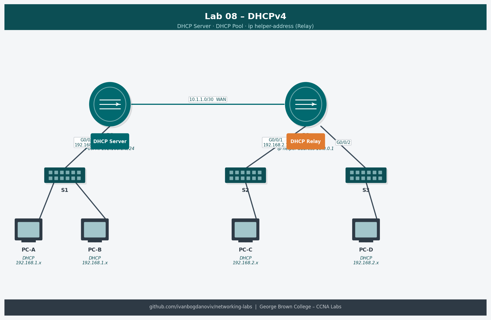

# Lab 08 — Implement DHCPv4 (7.4.2)

**Course:** CCNA Enterprise Networking, Security and Automation (CCNAv7)
**Platform:** NDG NETLAB+ / Cisco Packet Tracer
**Completed:** 2025-10-30 (practiced again 2025-11-05)
**Difficulty:** ⭐⭐⭐

## Objective
Configure a Cisco router as a DHCPv4 server with two address pools. Configure a second router as a DHCP relay agent to forward DHCP requests from clients on a remote subnet. Verify that all clients receive IP configuration automatically.

## Topology


```
PC-A               PC-B              PC-C
(DHCP client)      (DHCP client)     (DHCP client)
    |                   |                 |
  G0/0/0             G0/0/1           G0/0/0
  [R1 DHCP Server]===S0/0/0===S0/0/0===[R2 DHCP Relay]
  192.168.1.1                          192.168.4.1
```

## Addressing Table
| Device | Interface | IP Address | Subnet Mask | Default Gateway |
|--------|-----------|------------|-------------|-----------------|
| R1 | G0/0/0 | 192.168.1.1 | 255.255.255.0 | — |
| R1 | S0/0/0 | 10.0.0.1 | 255.255.255.252 | — |
| R2 | S0/0/0 | 10.0.0.2 | 255.255.255.252 | — |
| R2 | G0/0/0 | 192.168.4.1 | 255.255.255.0 | — |
| PC-A | NIC | DHCP | — | DHCP |
| PC-B | NIC | DHCP | — | DHCP |
| PC-C | NIC | DHCP | — | DHCP |

## Key Configurations
### R1 — DHCP Server
```
! Exclude static addresses from pool
R1(config)# ip dhcp excluded-address 192.168.1.1 192.168.1.9
R1(config)# ip dhcp excluded-address 192.168.4.1 192.168.4.9

! Pool for R1's local subnet
R1(config)# ip dhcp pool R1-LAN
R1(dhcp-config)# network 192.168.1.0 255.255.255.0
R1(dhcp-config)# default-router 192.168.1.1
R1(dhcp-config)# dns-server 192.168.1.1
R1(dhcp-config)# domain-name ccna-lab.com
R1(dhcp-config)# lease 6 0 0

! Pool for R2's remote subnet
R1(config)# ip dhcp pool R2-LAN
R1(dhcp-config)# network 192.168.4.0 255.255.255.0
R1(dhcp-config)# default-router 192.168.4.1
R1(dhcp-config)# dns-server 192.168.1.1
R1(dhcp-config)# domain-name ccna-lab.com
```

### R2 — DHCP Relay Agent
```
R2(config)# interface g0/0/0
R2(config-if)# ip helper-address 10.0.0.1
```

## Verification Commands
```
show ip dhcp binding
show ip dhcp pool
show ip dhcp statistics
show ip dhcp conflict
! On PCs:
ipconfig /all
ipconfig /renew
```

## What I Learned
- `ip dhcp excluded-address` must be configured before the pool — excludes static IPs from being assigned
- DHCP relay (`ip helper-address`) converts broadcasts to unicasts and forwards them to the DHCP server
- A router can serve DHCP for remote subnets it doesn't directly connect to — relay handles discovery
- `show ip dhcp binding` shows which MAC got which IP and the lease expiry
- `ip helper-address` is applied on the interface facing the clients, pointing to the server

## Troubleshooting Notes
- DHCP conflict detected: `show ip dhcp conflict` — clear with `clear ip dhcp conflict *`
- Relay not working: verify `ip helper-address` is on the correct interface (facing clients, not server)
- Clients not getting IPs: check excluded-address range doesn't cover the entire pool
- `show ip dhcp statistics` shows DISCOVER/OFFER/REQUEST/ACK counts — useful for diagnosing relay issues
