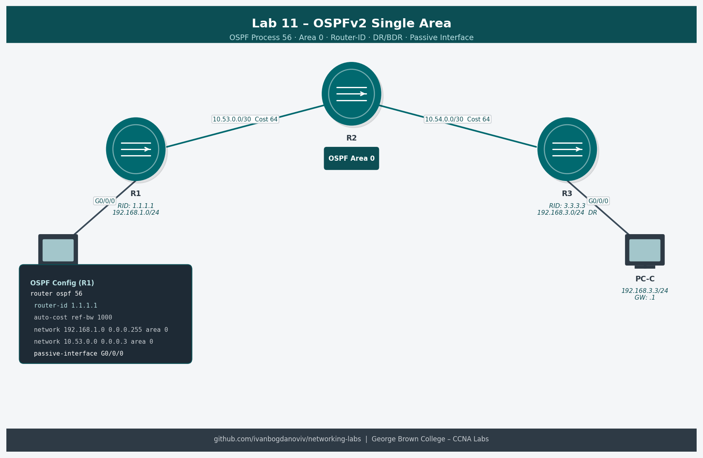

# Lab 11 — Configure Single-Area OSPFv2 (2.7.2)

**Course:** CCNA Enterprise Networking, Security and Automation (CCNAv7)
**Platform:** NDG NETLAB+ / Cisco Packet Tracer
**Completed:** 2026-01-20
**Difficulty:** ⭐⭐⭐⭐

## Objective
Configure OSPFv2 in a single area (Area 0) between two routers. Set router IDs manually, configure network statements, optimize OSPF with bandwidth reference, configure passive interfaces, and redistribute a default route to the OSPF domain.

## Topology


```
         Loopback 1
    172.16.1.1/24
         |
        [R1]===G0/0/1 (10.53.0.1/30)===G0/0/1===[R2]
                                                  |
                                             Loopback 1
                                          192.168.1.1/24
```

## Addressing Table
| Device | Interface | IP Address | Subnet Mask | Default Gateway |
|--------|-----------|------------|-------------|-----------------|
| R1 | G0/0/1 | 10.53.0.1 | 255.255.255.252 | — |
| R1 | Loopback1 | 172.16.1.1 | 255.255.255.0 | — |
| R2 | G0/0/1 | 10.53.0.2 | 255.255.255.252 | — |
| R2 | Loopback1 | 192.168.1.1 | 255.255.255.0 | — |

## Key Configurations
### R1 — OSPFv2
```
! Enable OSPF process 56
R1(config)# router ospf 56
R1(config-router)# router-id 1.1.1.1

! Advertise networks
R1(config-router)# network 10.53.0.0 0.0.0.3 area 0
R1(config-router)# network 172.16.1.0 0.0.0.255 area 0

! Optimization — match reference bandwidth to actual link speed
R1(config-router)# auto-cost reference-bandwidth 1000

! Don't send OSPF hellos on loopback (it's not a network link)
R1(config-router)# passive-interface loopback 1

! Redistribute default route into OSPF
R1(config)# ip route 0.0.0.0 0.0.0.0 loopback 1
R1(config)# router ospf 56
R1(config-router)# default-information originate
```

### R2 — OSPFv2
```
R2(config)# router ospf 56
R2(config-router)# router-id 2.2.2.2
R2(config-router)# network 10.53.0.0 0.0.0.3 area 0
R2(config-router)# network 192.168.1.0 0.0.0.255 area 0
R2(config-router)# auto-cost reference-bandwidth 1000
R2(config-router)# passive-interface loopback 1
```

## Verification Commands
```
show ip ospf neighbor
show ip ospf interface g0/0/1
show ip ospf interface brief
show ip route ospf
show ip route
show ip protocols
```

## What I Learned
- OSPF uses process IDs (locally significant) — R1 and R2 can have different process IDs
- Router-ID selection order: manually configured > highest loopback IP > highest active interface IP
- Always set router-ID manually — avoids unpredictable ID changes when interfaces go up/down
- `auto-cost reference-bandwidth 1000` (Mbps) fixes OSPF cost calculation for GigE links — default 100Mbps is outdated
- `passive-interface` stops OSPF hellos on that interface while still advertising the network
- `default-information originate` propagates a default route to all OSPF routers — requires a default route to exist first

## Troubleshooting Notes
- OSPF neighbor stuck in INIT: hello/dead timers mismatch between routers
- OSPF neighbor not forming: area mismatch, network statement doesn't include link IP, MTU mismatch
- `show ip ospf neighbor` — Full state means adjacency is working; any other state is a problem
- Routes not in table: check `show ip ospf database` to confirm LSAs are being exchanged
